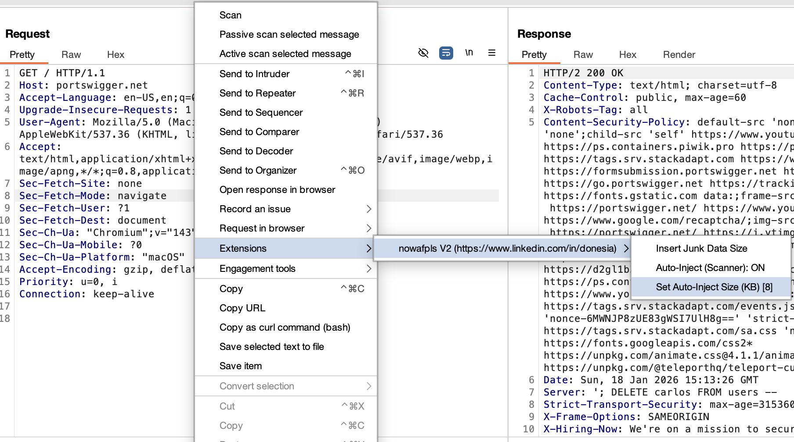
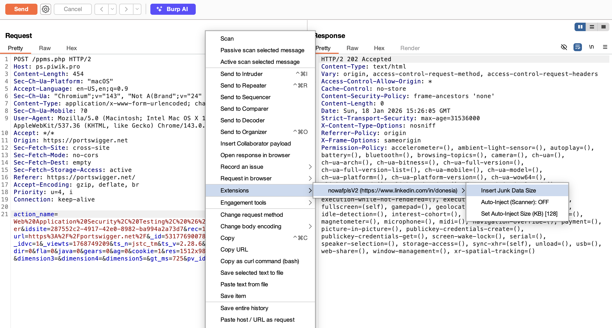

# nowafplsV2

Burp Suite extension to bypass WAF (Web Application Firewall) by injecting junk data into HTTP requests.

Based on [assetnote/nowafpls](https://github.com/assetnote/nowafpls) by Shubham Shah, with improvements and maintenance by [Irwan Kusuma](https://www.linkedin.com/in/donesia).

---

## Two Versions Available

| Version | API | Requirements | Best For |
|---------|-----|--------------|----------|
| **Python** (`nowafplsV2.py`) | Legacy Burp API | Jython 2.7 | Quick setup, existing Jython users |
| **Java** (`nowafplsV2-java/`) | Montoya API | Java 17+ | BApp Store, better performance |

Both versions have **identical functionality** - choose based on your preference.

---

## How It Works

Many WAFs have parsing limitations, such as only inspecting the first 8KB of a request body. By injecting random data (junk) before the actual payload, the payload can bypass WAF inspection.

**Example:**
```
POST /api/endpoint HTTP/1.1
Content-Type: application/json

{"junkfield":"aaaaaa...128KB...aaaaaa","username":"admin' OR 1=1--"}
```

The WAF only inspects the beginning of the request, allowing the SQL injection payload at the end to go undetected.

---

## Features

- **Manual Inject** - Insert junk data via right-click context menu
- **Auto-Inject Scanner** - Automatically inject junk into all Burp Scanner requests
- **Customizable Size** - Choose junk size: 8KB, 16KB, 32KB, 64KB, 128KB, 150KB, 1MB, or custom
- **Multi Content-Type Support** - Supports various request body formats
- **Persistent Settings** - Settings are saved between Burp sessions

---

## Screenshots

### HTTP History - Toggle Auto-Inject Scanner


### Repeater - Manual Insert Junk Data


---

## Supported Content-Types

| Content-Type | Junk Strategy |
|--------------|---------------|
| `application/x-www-form-urlencoded` | Random parameter: `&randomParam=xxxx...` |
| `application/json` | Random JSON field: `"randomKey":"xxxx..."` |
| `application/xml` | XML comment: `<!--xxxx...-->` |
| `multipart/form-data` | Random multipart field |
| `text/plain` | Direct random string |
| `application/graphql` | Line comment: `# xxxx...\n` |
| `application/yaml` / `text/yaml` | Line comment: `# xxxx...\n` |
| `application/ndjson` (JSON Lines) | Random JSON field/element |
| `text/csv` / `application/csv` | Random CSV row: `col1,col2,col3\n` |

---

## Installation

Choose **one** of the two installation methods below.

---

### Option A: Java Version (Recommended)

**Prerequisites:**
- Burp Suite Professional or Community Edition
- Java 17 or higher (usually bundled with Burp Suite)

**Installation Steps:**

1. **Download the JAR**
   - Download `nowafplsV2-2.0.0.jar` from the [Releases](https://github.com/irwankusuma/nowafplsV2/releases) page
   - Or build from source: `cd nowafplsV2-java && gradle build`

2. **Load the Extension**
   - Open Burp Suite
   - Navigate to **Extensions** > **Installed**
   - Click **Add**
   - Extension type: **Java**
   - Extension file: Select `nowafplsV2-2.0.0.jar`
   - Click **Next**

3. **Verify Installation**
   - The extension should appear in the list with status **Loaded**
   - Check the **Output** tab for: `[nowafplsV2] Extension loaded successfully.`

---

### Option B: Python Version

**Prerequisites:**
- Burp Suite Professional or Community Edition
- Jython Standalone JAR (required for Python extensions)

**Installation Steps:**

1. **Download Jython**
   - Visit [Jython Downloads](https://www.jython.org/download)
   - Download the `jython-standalone-2.7.x.jar` file

2. **Configure Jython in Burp**
   - Open Burp Suite
   - Navigate to **Extensions** > **Extensions settings** (or **Extender** > **Options** in older versions)
   - Under **Python environment**, click **Select file...**
   - Select the downloaded `jython-standalone-2.7.x.jar` file

3. **Load the Extension**
   - Navigate to **Extensions** > **Installed**
   - Click **Add**
   - Extension type: **Python**
   - Extension file: Select `nowafplsV2.py`
   - Click **Next**

4. **Verify Installation**
   - The extension should appear in the list with status **Loaded**
   - Check the **Errors** tab for any issues

---

## Usage

### Manual Inject

1. Open a request in **Repeater**, **Intruder**, or any tab with a request editor
2. Right-click on the request body
3. Select **Insert Junk Data Size**
4. Choose the junk size from the dropdown (8KB - 1MB) or select **Custom** for a specific size
5. Click **OK**
6. Junk data will be inserted at the appropriate position based on content-type

**Tips:**
- For URL-encoded/JSON/XML, junk is automatically inserted at a valid position
- For more control, highlight (select) the desired insertion point before right-clicking

### Auto-Inject for Scanner

1. Right-click anywhere in Burp
2. Select **Auto-Inject (Scanner): OFF** to enable
3. The menu will change to **Auto-Inject (Scanner): ON**
4. All requests from **Active Scan** will automatically have junk data injected
5. To disable, click the same menu item again

**Live Configuration:**
- Auto-inject can be **enabled/disabled while scanner is running** - takes effect on the next request
- Auto-inject size can be **changed while scanner is running** - takes effect on the next request

### Configure Auto-Inject Size

1. Right-click anywhere in Burp
2. Select **Set Auto-Inject Size (KB) [128]**
3. Enter the size in KB (e.g., 64, 128, 256)
4. Click **OK**

---

## Important Notes

### Burp Suite Edition
- **Community Edition** - Only supports **Manual Inject** (right-click menu in Repeater/Intruder)
- **Professional Edition** - Supports both **Manual Inject** and **Auto-Inject Scanner** (Active Scan required)

### HTTP Method Support
- Works with **any HTTP method** (GET, POST, PUT, PATCH, DELETE, etc.)
- Only requirement: request must have a **body** with supported content-type

### Unsupported Requests
- **Chunked Transfer-Encoding** - Not supported (will be skipped)
- **Unrecognized Content-Type** - A warning will be logged to Extender output

### Logging
- Requests with unsupported content-types are logged to **Extensions** > **Output**
- Errors appear in **Extensions** > **Errors** and as Burp alerts

### Comment Marker
- Injected requests are marked with the comment **"Junk Data"**
- Visible in the **Comment** column in HTTP history

---

## Troubleshooting

| Issue | Solution |
|-------|----------|
| Extension fails to load | Ensure Jython JAR is configured in Extensions settings |
| Context menu not appearing | Ensure you right-click in the request editor area, not response |
| Junk not inserted | Check the request content-type; ensure it is supported |
| Error during injection | Check the Errors tab in Extensions for details |
| Auto-inject not working | Ensure toggle is ON and you are running an Active Scan |

---

## Use Cases

1. **Bypass WAF Size Limits** - WAF only inspects the first N bytes
2. **Bypass Regex Timeout** - Large requests can cause WAF regex to timeout
3. **Test WAF Rules** - Evaluate WAF effectiveness against large requests
4. **Bug Bounty** - Bypass protections for authorized security testing

---

## WAF Inspection Limits Reference

Understanding WAF inspection limits helps you choose the right junk data size for bypass testing.

| Rank | Vendor WAF | Default Inspection Limit | Max Limit (Configurable) | Notes |
|------|------------|--------------------------|--------------------------|-------|
| 1 | Cloudflare | 8 KB (Pro) / 128 KB (Enterprise) | 1 MB (Enterprise) | Pro Plan: >8KB not inspected by WAF. Enterprise: default 128KB, can increase up to 1MB. |
| 2 | AWS WAF | 16 KB | 64 KB | CloudFront default 16KB. ALB/AppSync limited to 8KB fixed. |
| 3 | Akamai | 128 KB | 128 KB | Requires Advanced Metadata to increase. |
| 4 | Azure WAF | 128 KB | 2 MB | Latest engine (CRS 3.2) supports up to 2MB; v1 only 128KB. |
| 5 | F5 Adv. WAF | 64 KB | 10 MB - 20 MB | Default inspection often stops at 64KB before long buffer. |
| 6 | Imperva | 8 KB - 32 KB | 8 KB | Very strict at Cloud WAF level for global performance. |
| 7 | Fastly (Next-Gen) | 8 KB (VCL) | 100 KB (Agent) | Edge level (VCL) limit is very small (8KB). |
| 8 | Fortinet | 8 KB - 64 KB | Varies | Depends on hardware/VM model; buffer scan usually limited. |
| 9 | Barracuda WAF | 64 KB | Varies | Often allows large requests through if not strictly configured. |
| 10 | Google Armor | 8 KB | 128 KB | If exceeds 128KB, remaining body is not processed by WAF rules. |

**Recommended junk sizes based on target WAF:**
- **8 KB** - Imperva, Fastly VCL, Google Armor
- **16-64 KB** - AWS WAF, Fortinet, Barracuda
- **128 KB** - Cloudflare, Akamai, Azure WAF (default)
- **150 KB+** - When targeting Enterprise/custom configurations

---

## Disclaimer

This tool is intended for **legitimate penetration testing** and **security research** only. Use it only on systems you have permission to test. Misuse of this tool for illegal activities is the sole responsibility of the user.

---

## Credits

- **Original**: [assetnote/nowafpls](https://github.com/assetnote/nowafpls) by [Shubham Shah](https://github.com/infosec-au)
- **V2 Improvements**: [Irwan Kusuma](https://www.linkedin.com/in/donesia)

---

## License

MIT License - See [LICENSE](LICENSE) file for details.

---

## Building from Source (Java)

If you want to build the Java version from source:

```bash
# Clone the repository
git clone https://github.com/irwankusuma/nowafplsV2.git
cd nowafplsV2/nowafplsV2-java

# Build with Gradle
gradle build

# Output JAR location
ls build/libs/nowafplsV2-2.0.0.jar
```

**Requirements for building:**
- Java 17+ (JDK)
- Gradle 7.0+

---

## Changelog

### V2.0 (Current)
- **Java/Montoya API version** - New Java version for BApp Store compliance
- **Auto-Inject Scanner** - Automatically inject junk into all Active Scan requests (main V2 feature)
- Persistent settings (auto-inject configuration saved between sessions)
- Toggle auto-inject via context menu
- Customizable auto-inject size
- Additional content-type support:
  - `text/csv` / `application/csv`
  - `application/yaml` / `text/yaml`
  - `application/graphql`
  - `application/ndjson` (JSON Lines) - 12 variants supported
- Improved JSON object/array detection with indentation preservation
- BOM (Byte Order Mark) handling for UTF-8 (JSON, XML, JSON Lines)
- Intruder payload positions context exclusion
- Rate-limited error alerts
- Memory leak prevention for logging
- Comment marker "Junk Data" on injected requests (visible in HTTP History)

### V1 (Original by Assetnote)
- Manual junk data insertion in Repeater/Intruder
- Limited content-type support
