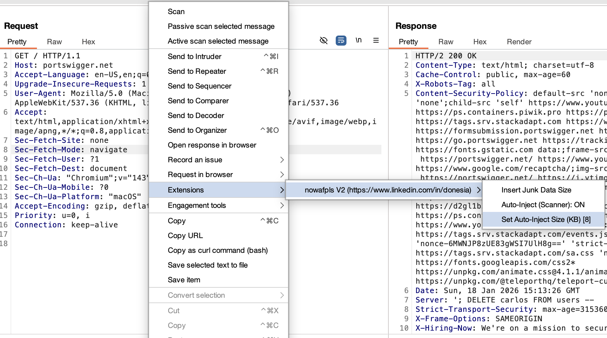
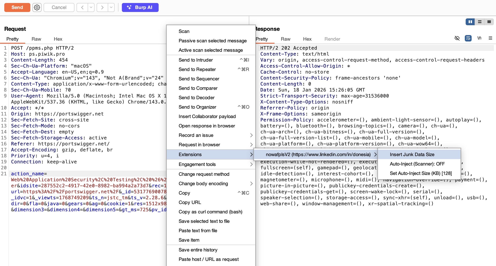

# nowafplsV2

A format-aware WAF bypass extension for Burp Suite that injects junk data into HTTP request bodies to exploit WAF inspection size limits.

Supports **9 content-type families** (including GraphQL, YAML, NDJSON, and CSV), generates **anti-fingerprint junk data** using 2,328 realistic parameter names, and is the only WAF bypass extension with **Burp Suite DAST (Enterprise) support**.

Based on [assetnote/nowafpls](https://github.com/assetnote/nowafpls) by Shubham Shah, with significant improvements by [Irwan Kusuma](https://www.linkedin.com/in/donesia).

---

## Key Differentiators

nowafplsV2 addresses critical gaps in existing WAF bypass extensions ([Firewall Ferret](https://github.com/PortSwigger/firewall-ferret), [WAF Bypadd](https://github.com/PortSwigger/waf-bypadd)):

- **Broadest content-type coverage** — 9 content-type families vs. 4 in existing extensions. Exclusive support for GraphQL, YAML, CSV, NDJSON/JSON Lines (12 MIME variants), and text/plain.
- **Anti-fingerprint junk data** — 2,328 realistic parameter name prefixes with random suffixes, producing billions of unique combinations. Existing extensions use hardcoded, trivially blockable names (`bullet`, `dummy123`) and single-character repeated content (`aaaa...`, `AAAA...`).
- **DAST (Enterprise) support** — The only WAF bypass extension that works with Burp Suite DAST, via `HttpHandler` intercepting `ToolType.EXTENSIONS`.
- **Format-aware intelligence** — JSON indentation preservation, BOM detection, empty object/array handling, chunked Transfer-Encoding detection, and NDJSON object-vs-array auto-detection.
- **All HTTP methods** — Works with POST, PUT, PATCH, DELETE, and any method with a body. WAF Bypadd only supports POST.
- **Persistent settings** — Configuration survives Burp restarts. Neither existing extension persists settings.

A [detailed, source-code-verified comparison](#comparison-with-similar-extensions) is provided below.

---

## Two Versions Available

| Version | API | Requirements | DAST Support | Best For |
|---------|-----|--------------|--------------|----------|
| **Python** (`nowafplsV2.py`) | Legacy Burp API | Jython 2.7 | No | Quick setup, existing Jython users |
| **Java** (`nowafplsV2-java/`) | Montoya API | Java 17+ | Yes | BApp Store, DAST, better performance |

Both versions have **identical functionality** for Desktop — choose based on your preference. For DAST, use the Java version.

---

## How It Works

Many WAFs have parsing limitations, such as only inspecting the first 8–128 KB of a request body. By injecting junk data before the actual payload, the attack payload is pushed beyond the WAF's inspection window.

**Example:**
```
POST /api/endpoint HTTP/1.1
Content-Type: application/json

{"userSession":"<random 128KB>","username":"admin' OR 1=1--"}
```

The WAF inspects the beginning of the request body and sees only the junk field. The SQL injection payload at the end passes through uninspected.

---

## Features

- **Manual Inject** — Insert junk data into any request via right-click context menu (Repeater and other message editors)
- **Auto-Inject Scanner/DAST** — Automatically inject junk into all Burp Scanner and DAST requests (enabled by default, 128 KB)
- **Live Configuration** — Toggle auto-inject and change size while a scan is running — takes effect on the next request
- **Customizable Size** — 8 KB, 16 KB, 32 KB, 64 KB, 128 KB, 150 KB, 1 MB, or custom
- **9 Content-Type Families** — Format-specific injection strategies for each (see table below)
- **Anti-Fingerprint** — Realistic, randomized parameter names and content that cannot be blocked by a single WAF rule
- **Persistent Settings** — Auto-inject state and size saved between Burp sessions
- **Comment Marker** — Injected requests are marked with `"Junk Data"` in the Logger comment column

---

## Screenshots

### HTTP History — Toggle Auto-Inject Scanner/DAST


### Repeater — Manual Insert Junk Data


---

## Supported Content-Types

| Content-Type | Injection Strategy |
|---|---|
| `application/x-www-form-urlencoded` | Random parameter prepended: `randomParam=<junk>&` |
| `application/json` | Random JSON field inserted after `{`: `"randomKey":"<junk>",` |
| `application/xml` / `text/xml` | XML comment after declaration: `<!--<junk>-->` |
| `multipart/form-data` | New multipart field prepended with proper boundary |
| `text/plain` | Random string prepended |
| `application/graphql` | Line comment: `# <junk>\n` |
| `application/yaml` / `text/yaml` | Line comment: `# <junk>\n` |
| `application/ndjson` (JSON Lines — 12 MIME variants) | Auto-detected: JSON object or array line prepended |
| `text/csv` / `application/csv` | Random CSV row with 3–8 columns appended |

Each strategy maintains valid syntax for its format — the server parses the request normally, ignoring the junk field.

---

## Installation

Choose **one** of the two methods below.

### Option A: Java Version (Recommended)

**Prerequisites:** Burp Suite Professional or Community Edition, Java 17+ (usually bundled with Burp)

1. **Download** `nowafplsV2-2.1.0.jar` from the [Releases](https://github.com/irwankusuma/nowafplsV2/releases) page, or build from source: `cd nowafplsV2-java && gradle build`
2. **Load:** Extensions > Installed > Add > Extension type: **Java** > Select the JAR
3. **Verify:** Check the Output tab for `[nowafplsV2] Extension loaded successfully.`

### Option B: Python Version

**Prerequisites:** Burp Suite Professional or Community Edition, [Jython Standalone JAR](https://www.jython.org/download)

1. **Configure Jython:** Extensions > Extensions settings > Python environment > Select `jython-standalone-2.7.x.jar`
2. **Load:** Extensions > Installed > Add > Extension type: **Python** > Select `nowafplsV2.py`
3. **Verify:** Check the Output tab and Errors tab

---

## Usage

### Manual Inject

1. Open a request in **Repeater** (or other message editor, excluding Intruder)
2. Right-click on the request body
3. Select **Insert Junk Data Size**
4. Choose the junk size (8 KB – 1 MB) or **Custom**
5. Click **OK** — junk data is inserted at the appropriate position based on content-type

**Tips:**
- Highlight (select) text to control the insertion point
- **For Intruder:** Insert junk in Repeater first, then Send to Intruder

### Auto-Inject for Scanner/DAST

Auto-inject is **enabled by default** (128 KB). All Active Scan and DAST requests automatically receive junk data.

**Toggle:** Right-click anywhere > **Auto-Inject (Scanner/DAST): ON/OFF**

**Change size:** Right-click anywhere > **Set Auto-Inject Size (KB) [128]** > Enter new size

Both settings can be changed while a scan is running and take effect on the next request.

---

## Important Notes

### Burp Suite Edition Support
| Edition | Manual Inject | Auto-Inject Scanner | Auto-Inject DAST |
|---|:---:|:---:|:---:|
| Community | ✅ | ❌ (no Active Scan) | ❌ |
| Professional | ✅ | ✅ | ❌ |
| DAST (Enterprise) | ❌ (no UI) | ✅ | ✅ (Java version only) |

### HTTP Method Support
Works with **any HTTP method** (GET, POST, PUT, PATCH, DELETE, etc.) — only requirement is a request body with a supported content-type.

### Unsupported Requests
- **Chunked Transfer-Encoding** — Detected and skipped safely (body-size bypass is incompatible with chunked encoding)
- **Unrecognized Content-Type** — Logged to Extensions > Output with deduplication (max 5,000 unique entries, FIFO eviction)

### Error Handling
- Rate-limited error alerts (60-second cooldown) to prevent alert spam during large scans
- Deduplicated logging with memory-safe FIFO eviction

---

## Troubleshooting

| Issue | Solution |
|---|---|
| Extension fails to load | Ensure Jython JAR is configured (Python version) or Java 17+ is available (Java version) |
| Context menu not appearing | Right-click in the **request** editor area, not response |
| Junk not inserted | Verify the request has a supported content-type header |
| Error during injection | Check Extensions > Errors tab for details |
| Auto-inject not working | Verify toggle is ON and you are running an Active Scan or DAST scan |

---

## Use Cases

1. **Bypass WAF Size Limits** — Push payloads beyond the WAF's body inspection window
2. **Bypass Regex Timeout** — Large request bodies can cause WAF regex engines to timeout
3. **Test WAF Configuration** — Evaluate whether a WAF is vulnerable to body size bypass
4. **Authorized Penetration Testing / Bug Bounty** — Bypass WAF protections during authorized engagements

---

## WAF Inspection Limits Reference

| Rank | WAF Vendor | Default Limit | Max Limit | Notes |
|---|---|---|---|---|
| 1 | Cloudflare | 8 KB (Pro) / 128 KB (Enterprise) | 1 MB (Enterprise) | Pro: >8 KB not inspected. Enterprise: configurable up to 1 MB. |
| 2 | AWS WAF | 16 KB | 64 KB | CloudFront default 16 KB. ALB/AppSync fixed at 8 KB. |
| 3 | Akamai | 128 KB | 128 KB | Requires Advanced Metadata to increase. |
| 4 | Azure WAF | 128 KB | 2 MB | CRS 3.2 supports up to 2 MB; v1 only 128 KB. |
| 5 | F5 Adv. WAF | 64 KB | 10–20 MB | Default inspection often stops at 64 KB. |
| 6 | Imperva | 8–32 KB | 8 KB | Very strict at Cloud WAF level. |
| 7 | Fastly | 8 KB (VCL) | 100 KB (Agent) | Edge level (VCL) limit is 8 KB. |
| 8 | Fortinet | 8–64 KB | Varies | Depends on hardware/VM model. |
| 9 | Barracuda | 64 KB | Varies | Often allows large requests if not strictly configured. |
| 10 | Google Cloud Armor | 8 KB | 128 KB | Beyond 128 KB, body is not processed by rules. |

**Recommended junk sizes:**
- **8 KB** — Imperva, Fastly VCL, Google Cloud Armor
- **16–64 KB** — AWS WAF, Fortinet, Barracuda
- **128 KB** — Cloudflare, Akamai, Azure WAF (default)
- **150 KB+** — Enterprise/custom WAF configurations

---

## Comparison with Similar Extensions

Below is a factual, source-code-verified comparison with the two existing BApp Store extensions that provide WAF bypass via junk data injection: [Firewall Ferret](https://github.com/PortSwigger/firewall-ferret) and [WAF Bypadd](https://github.com/PortSwigger/waf-bypadd).

### Content-Type Coverage

| Content-Type | nowafplsV2 | Firewall Ferret | WAF Bypadd |
|---|:---:|:---:|:---:|
| `application/x-www-form-urlencoded` | ✅ | ✅ | ✅ |
| `application/json` | ✅ | ✅ | ✅ |
| `application/xml` / `text/xml` | ✅ | ✅ | ✅ |
| `multipart/form-data` | ✅ | ✅ | ✅ |
| `text/plain` | ✅ | ❌ | ❌ |
| `application/graphql` | ✅ | ❌ | ❌ |
| `application/yaml` / `text/yaml` | ✅ | ❌ | ❌ |
| `application/ndjson` (JSON Lines, 12 MIME variants) | ✅ | ❌ | ❌ |
| `text/csv` / `application/csv` | ✅ | ❌ | ❌ |

nowafplsV2 supports **9 content-type families** with format-specific injection strategies, compared to 4 in both Firewall Ferret and WAF Bypadd. The 5 additional types — GraphQL, YAML, CSV, NDJSON/JSON Lines, and text/plain — are increasingly common in modern APIs and currently have no WAF bypass tooling in the BApp Store.

### Anti-Fingerprint Junk Data

A critical but often overlooked aspect of WAF bypass tooling is whether the junk data itself can be fingerprinted and blocked by WAF rules.

| Aspect | nowafplsV2 | Firewall Ferret | WAF Bypadd |
|---|---|---|---|
| **Parameter name** | 2,328 realistic prefixes + random suffix (e.g., `userSession`, `cacheBuffer`, `authToken`) | Hardcoded [`bullet`](https://github.com/PortSwigger/firewall-ferret/blob/main/src/main/java/model/creators/RequestBuilder.java) | Hardcoded [`dummy123`](https://github.com/PortSwigger/waf-bypadd/blob/main/waf_bypadd.py) |
| **Junk content** | Random alphanumeric characters (varied per request) | [`"a".repeat(N)`](https://github.com/PortSwigger/firewall-ferret/blob/main/src/main/java/model/creators/BulletFactory.java) — single character repeated | [`b'A' * N`](https://github.com/PortSwigger/waf-bypadd/blob/main/waf_bypadd.py) — single character repeated |
| **Fingerprintable?** | No — billions of unique combinations | Yes — a single WAF rule matching `bullet=aaa` blocks all bypass attempts | Yes — a single WAF rule matching `dummy123=AAA` blocks all bypass attempts |

A WAF administrator who discovers Firewall Ferret or WAF Bypadd in use can write one rule (e.g., block requests containing `"bullet":` or `dummy123=`) that permanently defeats the extension. nowafplsV2 generates realistic-looking parameter names from a pool of 2,328 common web parameter prefixes (`id`, `user`, `session`, `token`, `auth`, `cache`, `data`, etc.) combined with random suffixes, making each injected field indistinguishable from legitimate application parameters.

### Format-Aware Intelligence

| Feature | nowafplsV2 | Firewall Ferret | WAF Bypadd |
|---|:---:|:---:|:---:|
| JSON indentation preservation | ✅ | ❌ | ❌ |
| JSON empty object/array handling | ✅ | ❌ | ❌ |
| JSON array (`[...]`) body support | ✅ | ❌ | ❌ |
| BOM (Byte Order Mark) detection | ✅ | ❌ | ❌ |
| NDJSON auto-detection (object vs. array) | ✅ | ❌ | ❌ |
| Chunked Transfer-Encoding detection | ✅ (skipped safely) | ❌ | ❌ |
| Content-Length auto-update | ✅ | ✅ | ✅ |

- **JSON indentation:** nowafplsV2 captures and preserves the original whitespace pattern between `{` and the first key, ensuring the injected field matches the document's formatting. This prevents WAFs that normalize/re-parse JSON from detecting the injection point.
- **BOM handling:** nowafplsV2 detects UTF-8 BOM (`0xEF 0xBB 0xBF`) and UTF-16 BOM (`0xFEFF`), processes the body without the BOM, then re-prepends it. Without this, BOM-prefixed JSON bodies fail content-type detection — this is an actual bug in WAF Bypadd's JSON handler, where `body[0] == '{'` fails when a BOM is present.
- **Chunked TE:** nowafplsV2 detects `Transfer-Encoding: chunked` and skips injection, because body-size-based bypass is incompatible with chunked encoding. The other extensions do not check this and may produce malformed requests.

### Platform & Integration

| Feature | nowafplsV2 | Firewall Ferret | WAF Bypadd |
|---|:---:|:---:|:---:|
| Burp Suite DAST (Enterprise) support | ✅ | ❌ | ❌ |
| All HTTP methods (POST, PUT, PATCH, DELETE, etc.) | ✅ | ✅ | ❌ (POST only) |
| Persistent settings (survive Burp restart) | ✅ | ❌ | ❌ |
| Live toggle during active scan | ✅ | ✅ | ✅ |
| Live size adjustment during active scan | ✅ | ❌ | ❌ |
| Manual insertion (right-click) | ✅ | ✅ | ❌ |
| Java (Montoya API) version | ✅ | ✅ | ❌ |
| Python (Legacy API) version | ✅ | ❌ | ✅ |
| Rate-limited error alerts | ✅ | ❌ | ❌ |
| Deduplicated logging (memory-safe) | ✅ | ❌ | ❌ |

- **DAST support:** nowafplsV2's Java version registers an `HttpHandler` that intercepts both `ToolType.SCANNER` and `ToolType.EXTENSIONS` (DAST). Firewall Ferret uses [`InsertionPointProvider`](https://github.com/PortSwigger/firewall-ferret/blob/main/src/main/java/model/InsertPntProvider.java) which is a Scanner-only API and does not intercept DAST traffic. WAF Bypadd is a Python/Jython extension, and Burp Enterprise DAST [does not support Python extensions](https://portswigger.net/burp/documentation/enterprise/working-with-scans/burp-extensions).
- **HTTP methods:** WAF Bypadd explicitly filters [`if request_info.getMethod() != 'POST': return`](https://github.com/PortSwigger/waf-bypadd/blob/main/waf_bypadd.py), ignoring PUT/PATCH/DELETE requests that are standard in RESTful and GraphQL APIs. nowafplsV2 works with any method that has a body.
- **Persistent settings:** nowafplsV2 uses Burp's persistence API (`extensionData().setString()` / `loadExtensionSetting()`) to save auto-inject state and size across sessions. Firewall Ferret stores settings only in Swing component state (lost on restart; defaults to 8 KB checkbox only). WAF Bypadd stores settings as instance variables (lost on restart; defaults to all toggles off, 8 KB).

### What Firewall Ferret Does Differently

Firewall Ferret offers **multi-size scan check duplication**: it registers a custom [`InsertionPointProvider`](https://github.com/PortSwigger/firewall-ferret/blob/main/src/main/java/model/InsertPntProvider.java) that duplicates each Burp active scan check across up to 6 configurable sizes (8, 16, 32, 64, 128, 1024 KB). This means if Burp normally runs N checks on an insertion point, Firewall Ferret adds up to 6×N additional checks with junk prepended. This is a different architectural approach — nowafplsV2 instead injects a single configurable size into all scan requests via `HttpHandler`, which avoids scan time multiplication (up to 7× in Firewall Ferret) while covering the most common bypass scenario.

---

## Disclaimer

This tool is intended for **legitimate penetration testing** and **security research** only. Use it only on systems you have permission to test. Misuse of this tool for illegal activities is the sole responsibility of the user.

---

## Credits

- **Original:** [assetnote/nowafpls](https://github.com/assetnote/nowafpls) by [Shubham Shah](https://github.com/infosec-au)
- **V2 Improvements:** [Irwan Kusuma](https://www.linkedin.com/in/donesia)

---

## License

MIT License — See [LICENSE](LICENSE) file for details.

---

## Building from Source (Java)

```bash
git clone https://github.com/irwankusuma/nowafplsV2.git
cd nowafplsV2/nowafplsV2-java
gradle build
# Output: build/libs/nowafplsV2-2.1.0.jar
```

**Requirements:** Java 17+ (JDK), Gradle 7.0+

---

## Changelog

### v2.1.0 (Current)
- **DAST support** — Auto-inject works with Burp Suite DAST via `ToolType.EXTENSIONS`
- **Default auto-inject ON** — Enabled by default at 128 KB
- Identical output messages between Java and Python versions
- Unsupported content-type logging with deduplication (5,000-entry FIFO)
- Rate-limited error alerts (60-second cooldown)

### v2.0.0
- **Java / Montoya API version** — Modern API for BApp Store compliance and DAST support
- **Auto-Inject Scanner/DAST** — Automatically inject junk into all Active Scan and DAST requests
- Persistent settings via Burp's persistence API
- Toggle auto-inject and change size via context menu at runtime
- 5 new content-type families: GraphQL, YAML, CSV, NDJSON/JSON Lines (12 variants), text/plain
- JSON indentation preservation and empty object/array handling
- BOM (Byte Order Mark) detection for UTF-8 and UTF-16
- Chunked Transfer-Encoding detection (safely skipped)
- Anti-fingerprint parameter naming (2,328 realistic prefixes)
- Intruder payload positions context exclusion
- Rate-limited error alerts and memory-safe deduplicated logging
- Comment marker "Junk Data" on injected requests (visible in Logger)

### v1 (Original by Assetnote)
- Manual junk data insertion in Repeater
- URL-encoded, JSON, XML support
